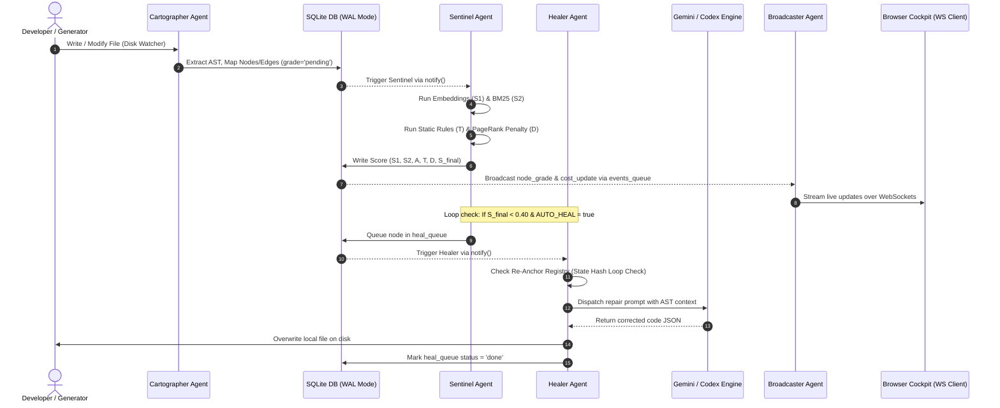

# CodexMap (CodexAxiom)

> **Real-Time Self-Healing Multi-Agent Cockpit for Code Generation & Context Drift Prevention**

[](https://www.npmjs.com)
[](https://nodejs.org)
[](#model-agnostic-engines)
[](#system-architecture)
[](#license)

---

## Live Cockpit Demo


*CodexMap real-time telemetry cockpit: live AST dependency mapping, real-time context drift scoring ($S_1, S_2, A, T, D$), and automated closed-loop self-healing over WebSockets.*

**[Watch High-Definition 80s Video Demo (MP4)](./assets/demo.mp4)**

---

## About CodexMap

When autonomous AI agents or multi-agent loops generate software codebases, they frequently suffer from **context drift**:
* As files accumulate, local edits inadvertently introduce broken dependencies, missing parameters, and incompatible interface signatures across the call graph.
* Syntactic safety slips (unhandled exceptions, loose equality, dangerous `eval` calls, or TypeScript `: any` types) bypass traditional compiler checks.
* Existing tools lack real-time visibility, causing AI generation runs to cascade into unrecoverable compilation failures—an effect known as **Architectural Collapse**.

**CodexMap** solves this by establishing a real-time developer cockpit and closed-loop self-healing framework. It maps code generation as a live interactive graph, continuously evaluates 5-dimensional drift scores in background agent threads, and automatically dispatches scoped LLM re-anchoring routines to repair drifted files without human intervention—all while strictly preventing infinite repair loops.

---

## Key Features

* **4-Agent Actor Pipeline**: Dedicated concurrent sidecars for file-mapping (`Cartographer`), drift-scoring (`Sentinel`), LLM code repair (`Healer`), and WebSocket streaming (`Broadcaster`).
* **5-Component Scoring Matrix**: Real-time evaluation combining semantic vector distance ($S_1$), vectorless lexical BM25 matching ($S_2$), architectural tree coherence ($A$), static AST type safety heuristics ($T$), and PageRank graph centrality penalty ($D$).
* **Closed-Loop Self-Healing**: Automatically catches drifted files ($S_{\text{final}} < 0.40$) and triggers scoped LLM re-invocations to rewrite and re-anchor code targets.
* **Infinite Loop Prevention (Re-Anchor Registry)**: Uses cryptographic SHA-256 state-signature tracking to cap repair retries and stop oscillating sister-node edit loops ($0\%$ runaway repair risk).
* **Model-Agnostic Engine Adapters**: Standardized plug-and-play adapter interface supporting Google Gemini, OpenAI Codex, and deterministic simulation engines (`--engine fake`).
* **Zero-Jitter Visual Cockpit**: Cytoscape.js interactive knowledge graph with decoupled layout computation, animated score deduction bars, and live API token/cost financial auditing.

---

## System Architecture



---

## The 5-Component Scoring Algorithm

Every node (file or function) in the graph is evaluated against the target prompt using the composite formula:

$$S_{\text{final}} = \max\left(0, \min\left(1, \frac{S_1 + S_2 + A + T}{4} - |D|\right)\right)$$

| Component | Metric Name | Purpose | Calculation Method |
| :--- | :--- | :--- | :--- |
| **$S_1$** | **Semantic Similarity** | Evaluates conceptual prompt alignment | Cosine similarity on 1536-dim code/prompt embeddings |
| **$S_2$** | **Vectorless Lexical RAG** | Ensures exact keyword & class presence | BM25 term frequency matching across tokenized nodes |
| **$A$** | **Architectural Consistency** | Penalizes unstable/broken dependencies | Coherence score based on parent context & child error rates |
| **$T$** | **Type Safety & Heuristics** | Detects syntax & error-handling hazards | Static pattern inspection (`eval`, `==`, `: any`, raw `db.` calls) |
| **$D$** | **Centrality Penalty** | Penalizes drift on central orchestrators | PageRank-weighted deduction: $D = -(\text{PageRank} \times (1 - S_1))$ |

---

## Quickstart

### 1. Run with NPX (No Installation Required)
```bash
# Run with Google Gemini engine
GEMINI_API_KEY="your-api-key" npx codexmap run "Build a secure REST API with JWT auth" --engine gemini

# Run with local simulation/fake engine (offline & zero cost)
npx codexmap run "Build a banking app with accounts" --engine fake
```

### 2. Local Installation & Development
```bash
# Clone the repository
git clone https://github.com/your-username/codexmap.git
cd codexmap

# Install dependencies
npm install

# Run doctor diagnostic
node bin/codexmap.js doctor

# Start local daemon
node bin/codexmap.js run "Build an express service" --engine fake --watch ./output
```

### 3. CLI Command Options

| Flag | Default | Description |
| :--- | :--- | :--- |
| `--engine` | `codex` | Engine adapter (`gemini`, `codex`, or `fake`) |
| `--watch` | `./output` | Target folder to monitor and map |
| `--port` | `3333` | HTTP Cockpit dashboard port |
| `--ws-port` | `4242` | WebSocket real-time telemetry streaming port |
| `--auto-heal` | `false` | Automatically heal nodes with $S_{\text{final}} < 0.40$ |
| `--no-open` | `false` | Prevent opening browser on startup |
| `--model` | `gemini-1.5-flash` | LLM model name for generative engine |

---

## Releases & Versioning

### Current Release: `v0.1.0-alpha.1`

#### Highlights & Changelog
* **Multi-Agent Runtime**: Core orchestration pipeline with Cartographer, Sentinel, Healer, and Broadcaster.
* **Native Gemini Adapter**: Dependency-free Google Gemini API engine adapter supporting structured JSON responses.
* **Re-Anchor Loop Prevention**: Cryptographic state-hash registry preventing infinite agent repair loops.
* **Interactive Cockpit UI**: Modern Cytoscape graph canvas, formula breakdown cards, deduction bars, and live API cost budgeting.
* **SQLite WAL Datastore**: Thread-safe concurrent logging and event queues with busy-timeout configurations.

### Release Preflight Checklist
Before publishing a new release:
```bash
npm run release:preflight
```
This runs syntax checks, unit tests, engine contract validations, and package tarball verification.

### Publishing to NPM
```bash
npm publish --provenance --access public
```

---

## Repository Structure

```
codexmap/
├── bin/
│   └── codexmap.js           # CLI entry point (run, doctor, engines, ui)
├── agents/
│   ├── cartographer.js       # AST dependency mapping agent
│   ├── sentinel.js           # 5-component scoring & drift detection agent
│   ├── healer.js             # Autonomous LLM code re-anchoring agent
│   └── broadcaster.js        # WebSocket real-time event streaming agent
├── engines/
│   ├── contract.js           # Engine adapter interface contract
│   ├── gemini.js             # Native Google Gemini API engine adapter
│   ├── gemini_worker.js      # Child-process worker for Gemini HTTPS calls
│   ├── codex.js              # OpenAI Codex engine adapter
│   └── fake.js               # Mock/simulation engine for deterministic testing
├── lib/
│   ├── db.js                 # SQLite database (WAL mode, event queues)
│   ├── cost.js               # Token expenditure & API cost tracker
│   ├── runtime.js            # Daemon lifecycle coordinator
│   └── atomic.js             # Atomic file operations & directory helpers
├── ui/
│   ├── index.html            # Cockpit dashboard application entry
│   ├── graph.js              # Cytoscape.js interactive knowledge graph
│   ├── panel.js              # Detailed score breakdown & formula card
│   └── ws.js                 # WebSocket client event broker
└── assets/
    ├── codexmap-demo.gif     # Embedded animated demo preview
    └── demo.mp4              # Full high-definition video walkthrough
```

---

## License

Distributed under the **MIT License**.
